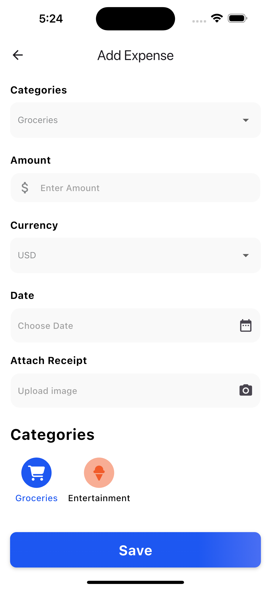

# expense_tracker_lite

1- Overview of the architecture and structure

data/: Handles all interactions with the local SQLite database.
models/: Contains plain Dart models, mainly Expense.
providers/: Contains business logic using Provider for state management.
screens/: UI for different app sections.
utils/: Utility/helper functions used across the app.
constants/: Centralized constants like colors and strings.
widgets/: Contains reusable UI components like tiles and buttons.
2- State management approach This project uses the Provider package for state management with multiple providers handling different concerns:

ExpenseProvider: Manages loading, filtering, and pagination of the expenses list from the local database. It handles retrieving and updating the displayed expenses and notifies the UI of changes.

AddExpenseProvider: Dedicated to managing the state related to adding new expenses, including input validation and saving new expense entries to the database.

3- How you implemented API integration

API (https://open.er-api.com/v6/latest/USD). The method fetchCurrencies() sends an HTTP GET request, waits for a response with a timeout of 5 seconds, and parses the JSON response to extract currency rates.

The retrieved rates are stored as a list of maps containing currency codes and their corresponding rates. If the currently selected currency is not found in the fetched list, it defaults to USD or the first available currency.

The method handles errors gracefully by updating an error message string and managing a loading state (isLoadingCurrencies) to inform the UI of the current process status.

This approach ensures real-time currency conversion data to accurately track expenses in different currencies

4-Pagination strategy (local vs. API)

In this project, the pagination strategy relies on loading data from a local SQLite database instead of calling an external API for each page.

This approach improves performance and reduces the need for internet connectivity, especially since the expense data is stored and updated locally.

Expenses are loaded in pages by querying the local database with an offset and limit.

When the user requests a new page, new data is fetched and appended to the existing list, allowing smooth browsing with fast response times.

5- UI Screenshots

6- Any trade-offs or assumptions

I chose HTTP package for API calls because the requests are simple and don’t have complex constraints.

I used Provider for state management due to the project's simplicity.

Usually, I use Generic BLoC, dio, and Repository patterns for handling requests in more complex projects.

7-How to run the project

use any flutterSdk version android stadio and run it in ios or android semulators

8- Any known bugs or unimplemented features I complete every requird point and add animatios in navigation and expenses view

6-